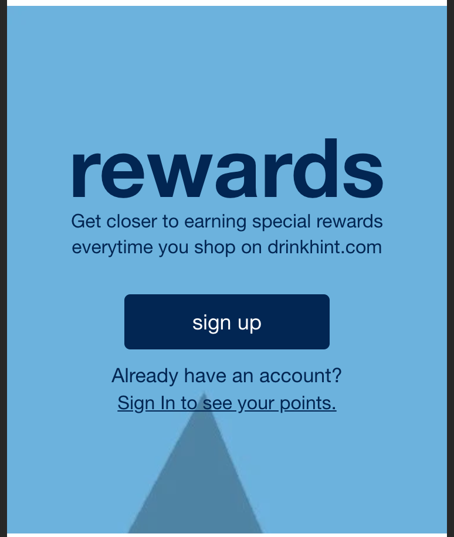
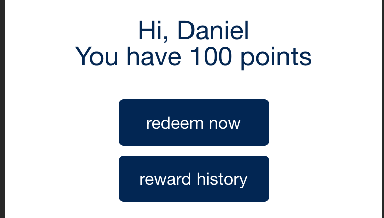

# Demo

## Swell Widgets

### Swell Welcome Widget Options
Widget configuration is set up in the shopgate merchant admin. All widget configurations for the Swell Welcome Widget except for `loggedOutBackgroundImage` are required.
Example configuration for the following images:



#### Config:
```json
 <!--Widget
{
  "type": "@shopgate-project/swell/SwellWelcome",
  "settings": {
    "buttonBackgroundColor": "#002554",
    "buttonFontColor": "#fff",
    "headerTextColor": "#022653",
    "historyButtonText": "reward history",
    "redeemButtonText": "redeem now",
	  "loggedOutTitleFontColor": "#002554",
    "loggedOutTitle": "rewards",
    "loggedOutSubtext": "Get closer to earning special rewards everytime you shop on drinkhint.com",
    "signUpText": "sign up",
    "accountText": "Already have an account?",
    "signInText": "Sign In to see your points.",
    "loggedOutBackground": "url(//cdn.shopify.com/s/files/1/0014/3015/9418/files/swell-banner.jpg?140743)",
    "widgetMargin": "10px 0"
  }
}
-->
```